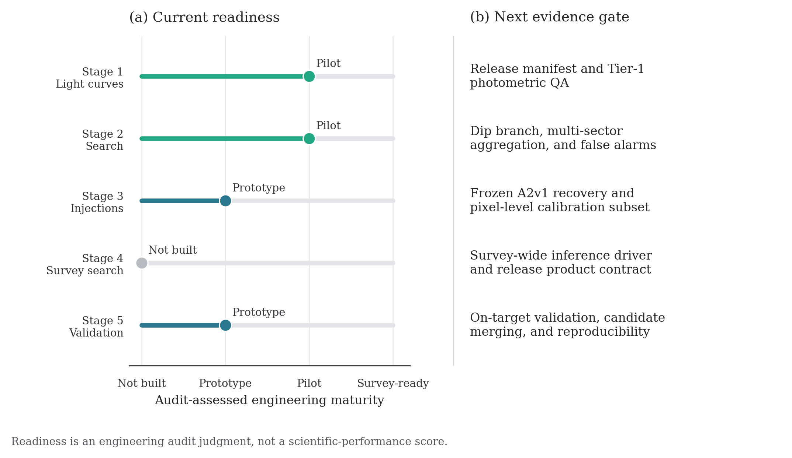
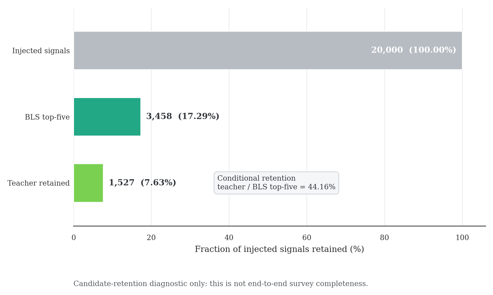
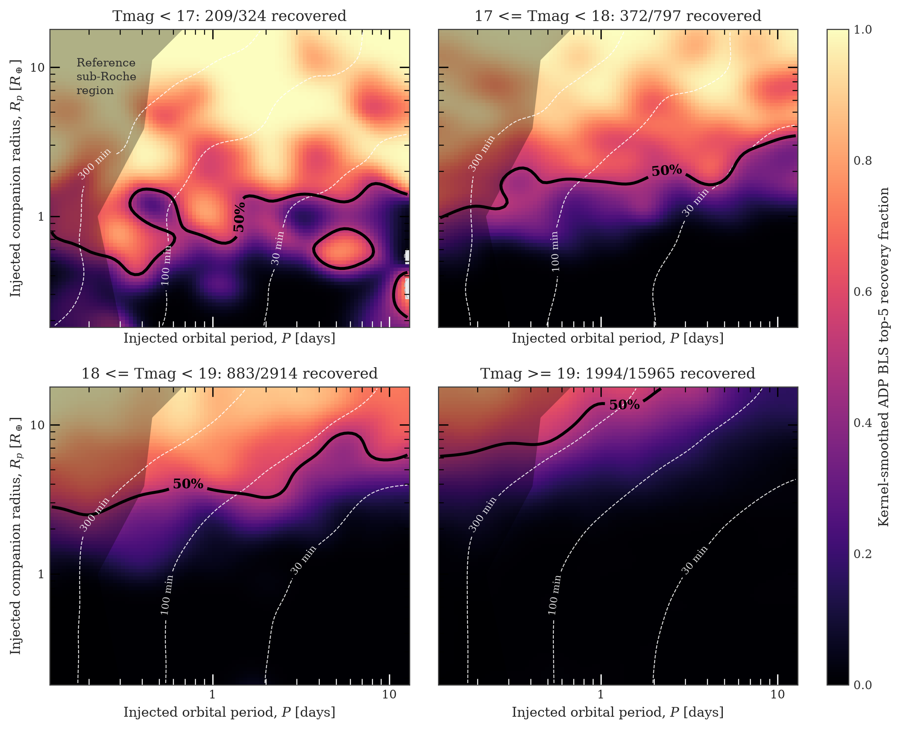

# TWIRL repository audit and near-term execution plan

**Internal technical report - 2026-07-16**

## Abstract

We audited the TWIRL repository as an executable survey pipeline, with emphasis on reproducibility, production safety, validation semantics, generated-artifact hygiene, and alignment between the Stage 1-5 plan and the code that now exists. The repository has a credible pilot foundation: Stage 1 produces validated A2v1 light curves, Stage 2 supports an interpretable periodic search, and the fast validation suite is healthy. It is not yet a survey-complete system. The critical gaps are a frozen release manifest, science-level photometric QA, the non-periodic dip branch, multi-sector aggregation, false-alarm calibration, frozen-product injection recovery, and on-target end-to-end validation. We recommend keeping teacher development as bounded triage work while moving these baseline survey gates onto the critical path.

## Methods

The scan combined repository-wide inventory, Git/worktree inspection, parser and link checks, shell and Python syntax checks, the project fast test suite, and review of the authoritative plan, production protocol, data conventions, and plotting rules. The audit checkpoint contained 1,964 tracked files (955 under `reports/`, 611 under `outputs/`, 271 under `scripts/`, 49 under `src/`, and 48 under `tests/`) and about 740 MiB of tracked working-tree content. The fast suite completed with 246 passed and 2 skipped tests. Code paths were compared with the declared Stage 1-5 contract. We distinguished a Tier-0 integrity gate (schema, coverage, openability, and benchmark checks) from the still-open Tier-1 science QA gate (photometric precision, cadence loss, aperture outliers, injection preservation, and an independent extraction comparison). Generated data and historical binaries were treated as reproducible artifacts unless they were compact evidence needed to interpret a result.

## Results

**Figure 1.** Audit-assessed engineering maturity and the next evidence gate for each pipeline stage. The readiness scale describes implementation maturity, not scientific performance. Stage 1 and the periodic part of Stage 2 are at pilot maturity; Stage 3 and Stage 5 remain prototypes; the Stage 4 survey-wide inference layer is not yet built.

The strongest result is separation of the production contract from later analysis: A2v1 generation, validation, compact export, and an interpretable BLS path now have explicit boundaries. The most important weakness is that an integrity-valid sector can still lack the evidence required for scientific readiness. The audit also found a mismatch between the clean forward plan and experimental teacher-v2 and S57 labeling work already present in the repository. These products should be preserved as exploratory evidence, but they should not silently redefine the production baseline or consume the untouched validation holdout.

Repository hygiene is acceptable at the source level but weak at the artifact-history boundary. At scan time the Git object store was approximately 14 GiB and dominated by historical generated outputs. The on-disk `reports/` tree was approximately 5.5 GiB because it also contained large ignored or untracked review artifacts, while `src/`, `scripts/`, and `tests/` together occupied only about 15 MiB. Nonportable symlinks, stale caches, large third-party reference bundles, and redundant rendered review material should remain outside versioned survey products. History rewriting is not recommended during the active branch stack; compact manifests and an explicit artifact allowlist are safer immediate controls. The local `.venv` reported NumPy 2.2.6 even though `pyproject.toml` requires `numpy>=1.24,<2.0`; the tests passed, so this is environment drift rather than an observed failure.

**Figure 2.** Candidate-retention diagnostic for the 20,000-signal teacher-v1 experiment. The top-five BLS stage retained 3,458 signals (17.29% of injections), and the teacher retained 1,527 (7.635% of injections; 44.16% conditional on top-five BLS recovery). This diagnostic does not include the full search, vetter, candidate-merging, or pixel-level calibration chain and therefore is not end-to-end survey completeness.

The attrition is scientifically useful because it localizes losses, but it also shows why classifier iteration cannot substitute for baseline search and calibration. The current language should reserve “end-to-end recovery” for a frozen chain that includes search, optional ranking, vetting, candidate merging, and the adopted calibration products. The present teacher result is more accurately a candidate-retention efficiency.

### Period-radius candidate-retention surface

**Figure 3.** A2v1 Teacher-v1 BLS top-five candidate-retention surface for 20,000 injected signals, split into four Tmag strata. Recovery fractions are kernel-smoothed; each panel prints its recovered and injected support counts, and the bright bin is comparatively sparse. The map diagnoses where the BLS candidate list retains injected signals. It is not end-to-end survey completeness and should not be used as an occurrence-rate selection function.

The surface supplies more structure than the aggregate attrition count: candidate retention depends on injected period, companion radius, and target brightness. Its role here is to expose support and search behavior, not to promote a final completeness claim. A frozen survey analysis must propagate the same injections through the adopted vetter, candidate merger, and calibration chain before interpreting the surface as completeness.

## Recommendations

1. **Freeze the survey release contract.** Record an explicit TWIRL-I sector cutoff, target/sample version, A2v1 product tag, search configuration, and checksums in a machine-readable release manifest. Without a cutoff, the `Sector >= 56` denominator expands continuously.
2. **Complete Tier-1 photometric QA.** Add scatter-versus-magnitude regression, cadence-loss distributions, aperture disagreement thresholds, fixed injection-preservation tests, and a genuinely independent benchmark extraction. Keep Tier-0 integrity status separate.
3. **Finish the transparent baseline search before new ML gates.** Implement the non-periodic dip branch, multi-sector candidate consolidation, and an empirical false-alarm strategy. These are required even if teacher ranking remains useful.
4. **Calibrate recovery on frozen products.** Run injections through the adopted search, ranker if used, vetter, and merger; include a bounded pixel-level subset to measure detrending and extraction losses.
5. **Quarantine exploratory teacher work.** Preserve teacher-v2 and early S57 labels with provenance, mark them exploratory, pause further holdout consumption, and require external-retention and morphology checks before promotion.
6. **Control repository growth prospectively.** Version compact summaries, manifests, selected figures, and small label tables. Keep review sheets, dependency bundles, shard payloads, and local literature copies in ignored storage. Defer Git history surgery until every active branch and worktree is clean and pushed.
7. **Rebuild and automate the release environment.** Rebuild the local environment from `pyproject.toml` before release validation. Once the dependency or lock strategy is settled, add pull-request CI for `make test-fast` and `make check-docs`. This is a medium-priority engineering safeguard below the science critical path, not evidence of a current test failure.

A practical execution order is: (i) finish the A2v1 queue with Tier-0 gates and compact exports, (ii) freeze the release manifest and implement Tier-1 QA, (iii) complete the dip, multi-sector, and false-alarm baseline, (iv) run frozen-product recovery and pixel calibration, and (v) perform survey-wide inference and on-target validation. Bounded human labeling can proceed in parallel only when it does not delay these gates.

## Conclusion

TWIRL is beyond a collection of experiments: it has a testable pilot pipeline and a clear production contract. The next advance should be evidentiary rather than architectural. Freezing the release, separating integrity from science QA, completing the transparent search branches, and measuring recovery through the whole adopted chain will convert the current pilot into a defensible survey framework. The audit figures and this report are reproducible from [`scripts/build_repository_audit_report.py`](../../scripts/build_repository_audit_report.py); the project plan and detailed execution record remain authoritative in [`doc/twirl_plan.md`](../../doc/twirl_plan.md) and [`doc/twirl_progress_log.md`](../../doc/twirl_progress_log.md).
