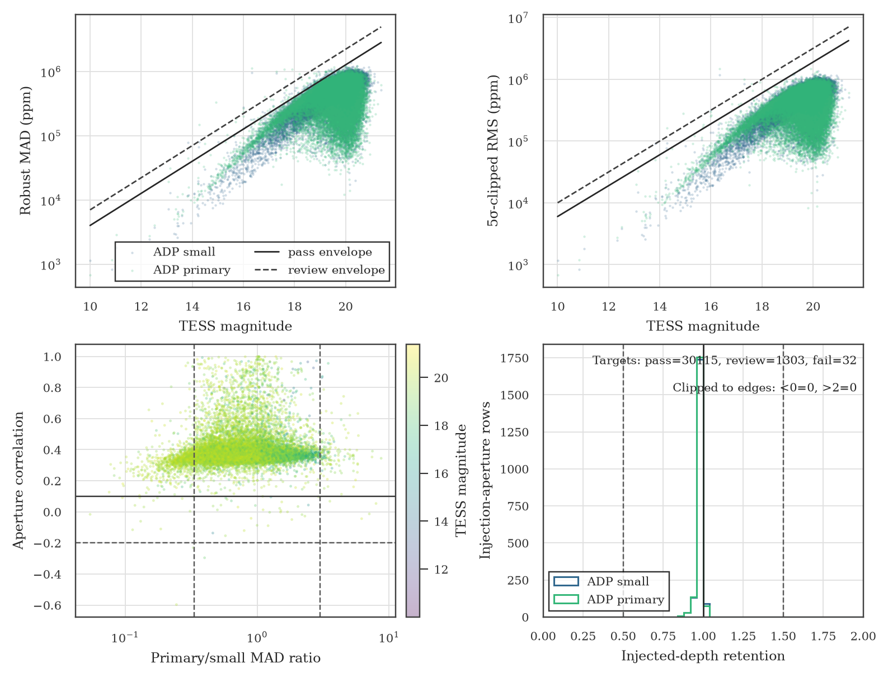
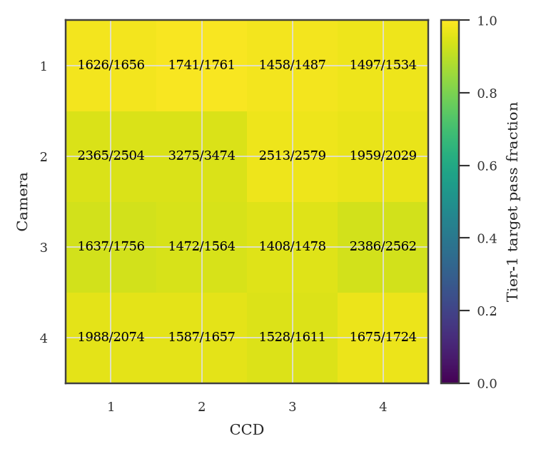

# S56 A2v1 active-search-pair Tier-1 quality assessment

**Scope:** bounded enrichment QA for `DET_FLUX_ADP_SML` and
`DET_FLUX_ADP`

**Contract:** `a2v1_tier1_science_qa_v2`

**Assessment date:** 2026-07-23

**Promotion enabled:** no

**Science ready:** no, by contract

## Abstract

We assess whether the Sector 56 A2v1 active search pair is sufficiently
controlled for target-filtered candidate enrichment. The audit covers the full
compact population of 31,450 targets, a hash-bound 188,396-row external
cadence/quality reference with four declared authority exclusions, a
quality-aware 2,000-injection v2 canary regenerated from the unchanged frozen
schedule, aperture behavior, and an independent
official-TESSCut recovery of WD 1856 b. The final bounded-gate outcome is
**review** (`passed=false`, `enrichment_ready=false`). Seven of eight gates
pass; the cadence/finite-data gate is review because the cam1/ccd1 median
usable-cadence fraction is 0.743, below the predeclared 0.80 pass line.
This two-aperture assessment cannot promote the six-channel A2v1 product and
retains `science_ready=false`.

## Methods

### Data and scope

The evaluated compact product contains 31,450 S56 targets. The search channel
is the small ADP aperture (`DET_FLUX_ADP_SML`); the primary ADP aperture
(`DET_FLUX_ADP`) supplies cross-aperture contamination and consistency
evidence. The audit deliberately excludes the ADP015 branches and the 5x5
aperture, so it is an enrichment gate rather than release QA.

The external-quality reference combines QLP camera-quaternion cadence
authority with SPOC quality flags. Its 188,396 rows cover the S56 detector
timeline after declaring exactly four missing-authority cases: cadence 699957
for camera 3, CCDs 1–4. Those four rows are masked with the reserved external
quality bit and remain visible in provenance.

### Gate design

Eight fail-closed gates test: cadence-reference provenance, compact-to-injection
source parity, the quality-aware Tier-0 prerequisite, scatter versus TESS
magnitude, cadence retention and finite flux, aperture outliers, injected-depth
preservation, and independent extraction. The fixed canary comprises four
reviewed shards and 2,000 unique injected hosts. Injected-depth retention is
the fitted response against
`(injection_baseline / detrend_scale) * (1 - transit_model)`; the corresponding
raw-depth slope is retained only as a diagnostic of normalization transfer.
Every evidence input is checksum-bound before the population scan and
rechecked before output publication.

The independent benchmark uses official MAST TESSCut data rather than another
TGLC production tree. WD 1856 b is recovered in its 1x1 reference aperture at
period 1.407960330 d with BLS S/N 11.87 and an approximately 1.27 min epoch
residual. The WCS-defined 2x2 reference aperture gives period 1.407896973 d,
BLS S/N 11.33, and an approximately 0.23 min epoch residual. These
measurements establish the independent evidence input and pass the locked
end-to-end audit.

## Results

The PDO quality-aware BLS and replacement Tier-0 products passed review and
are checksum-pinned before the ORCD population audit.

The first v1 evaluator run (ORCD job `18641848`) failed before the population
scan. Its retention predictor omitted the stored injection-baseline and
detrending-scale normalization, and one frozen epoch had no effective-good
in-transit samples after the external-quality overlay. Correcting the
definition gave median retention near 0.991 in both apertures, while v2
resampled epochs against the authoritative effective-quality mask, including
the previously invalid case. This was a fail-closed contract-remediation
event, not a scientific Tier-1 failure.

The first v2 preflight (ORCD job `18651862`) also stopped before population
scanning because the configuration still pinned the v1 realization-metadata
digest. The injection IDs and all schedule/host fields were bit-for-bit
unchanged, but effective-quality epoch sampling resampled all 2,000 epochs and
changed the cadence-sampled `model_depth` for 1,591 injections. A hybrid
recalculation replacing only `model_depth` transforms the v1 digest
`54996889…1910` into the v2 digest `b56a0b84…f0b0`. The v2 realization hash
was therefore relocked without changing the sample or any gate threshold.

The exact full-population run (ORCD CPU job `18652943`) completed in 4 min
58 s from evaluator/config commit `5adae3b6`. It returned exit code 1 because
the contract encodes review as non-passing, not because the program crashed.

| Gate | Status | Principal result |
|---|---:|---|
| Cadence-reference prerequisite | **Pass** | 188,396 rows; 4 declared authority exclusions |
| Injection-source parity prerequisite | **Pass** | 188,700 dataset comparisons; 0 target mismatches |
| Tier-0 prerequisite | **Pass** | All 6 nested gates; summary `1f7865b9…432ca`, BLS table `c3a7bd9f…10692` |
| Population scatter | **Pass** | 6 supported bins per aperture; log-MAD slopes 0.231 and 0.135; high-residual fractions 0.019% and 0.029% |
| Cadence and finite data | **Review** | Zero median/p95 cadence loss and 100% finite quality-zero flux; usable fraction median 0.916, p05 0.754; cam1/ccd1 detector median 0.743 |
| Aperture outliers | **Pass** | 99.987% valid ratios; 3.676% moderate and 0.032% extreme outliers; median correlation 0.363 |
| Fixed-injection preservation | **Pass** | 2,000 IDs on 16 detectors; median retention 0.991 in both apertures, p10 0.967 and 0.966, 100% in-band |
| Independent extraction | **Pass** | 100% common-cadence coverage; WD 1856 b passes in both independent apertures |

**Overall status:** **review** (`passed=false`)

**Target eligibility:** 30,115 pass; 1,303 review; 32 fail. The main review
reasons are aperture MAD ratio (1,160) and absolute scatter (159).

**Enrichment ready:** `false`

**Science ready:** `false` (fixed by scope, not a pending measurement)

## Figures

*Figure 1.* Full-population MAD and 5-sigma-clipped RMS versus TESS magnitude,
aperture MAD ratio versus correlation, and injected-depth retention. Both
scatter loci remain below the pass envelopes; the injection distributions are
tightly centered near one with no values clipped below zero or above two.
[Vector PDF](tier1_qa_diagnostics.pdf)

*Figure 2.* Fraction and count of targets passing the final target-level
filter by camera and CCD. All 16 cells are populated, with pass fractions from
0.931 to 0.989. The overall review is not a missing-cell or target-pass
deficit: it is the separate detector-level usable-cadence check for cam1/ccd1.
[Vector PDF](tier1_detector_eligibility.pdf)

## Limitations

This assessment covers two ADP apertures in one sector. It does not audit all
six ADP/ADP015 channels, establish a survey denominator, calibrate periodic or
dip-search false alarms, merge multi-sector detections, or measure full
search-to-vetting completeness. WD 1856 b is a necessary benchmark but one
favorable system cannot establish survey-wide sensitivity. Passing this gate
would therefore authorize only the use of target-filtered S56 inputs for
bounded enrichment; a review or failure would require remediation before that
use. The current review does not authorize enrichment.

The published mask is keyed by `(sector, TIC)`. Its Gaia DR3 column is empty in
the compact export, so the mask must be joined back to the authoritative
master catalog before a candidate corpus or release-facing table is frozen.

## Repository audit and reproducibility

The accompanying repository scan found 2,183 tracked files occupying
approximately 802 MB, dominated by `reports/` (630 MB) and `outputs/`
(167 MB); `.git` occupies approximately 14 GiB. Fifteen tracked files are at
least 10 MB, and 80 already-tracked files now match ignore rules
(approximately 47 MB). No secret-scan, broken-symlink, cache, syntax, or
untracked-file hygiene blocker was identified. The current validation suite
passes 413 tests with 3 skips, together with the detection sample and
documentation checks.

These figures argue for a later, explicit artifact-retention migration rather
than history rewriting during the QA run. In particular, authoritative label
artifacts must be separated from regenerable tensors and presentation
scratch products before large files are untracked. Reproducibility of this
assessment rests on the locked configuration, exact compact checksum, cadence
table and manifest checksums, injection shard and source-parity checksums,
independent-extraction checksums, the Tier-0 summary (`1f7865b9…432ca`) and
BLS table (`c3a7bd9f…10692`) checksums, and v2 shard-producer commit
`f1b8b53c7f2b2c62912e9d240b595458cbbd5d14`. The ordered v2 shard hashes are
`fe999651…6525`, `7b166ddf…fa07`, `4d6f8f11…ce9b`, and
`9e309d6b…e5a4`. The selection digest remains `8ee40ea7…6c5a`, while the v2
epoch-realization metadata digest is `b56a0b84…f0b0`. The final locked
evaluator/config revision is
`5adae3b62fe9bc6785e7df754a57e06eb85a00a9`.

## Verdict

**S56 should not yet enter the target-filtered enrichment workflow.** The
result is close and scientifically informative, but the predeclared contract
correctly returns review. Cam1/ccd1 has zero missing-cadence loss, yet its
internal-or-external quality union leaves a median usable fraction of 0.743.
The cause is concentrated in orbit 119: the locked external mask is good for
65.5% of cadences there versus 99.0% in orbit 120, dominated by one contiguous
1,929-cadence flagged interval rather than a cadence-join bug.

The cleanest remediation is conservative: define a new enrichment-only scope
that excludes cam1/ccd1, retain all thresholds, and rerun the same gate. That
would remove 1,656 targets from this enrichment pass while leaving 28,489
already-pass targets in the other 15 detector cells. The excluded detector
should remain in the survey archive for later quality-mask calibration; this
is not a change to the statistical parent sample. Retrospectively lowering the
0.80 detector threshold is not recommended.

The non-negotiable interpretation remains `science_ready=false`: even a later
clean pass is evidence for bounded enrichment, not a science-ready search
pipeline or survey release.

The teacher-model bottleneck is presently data and evaluation infrastructure,
not a demonstrated lack of model capacity. Teacher v1 should remain the
seven-harmonic enrichment baseline. The next retrain should use the frozen
S56–S62 observation corpus only after quality-aware native inputs, immutable
TIC-grouped splits, source-separated evaluation, one out-of-fold calibration
transform, and complete checksum provenance exist. Teacher v2, student
pseudo-labeling, and architecture sweeps should remain off the critical path.

## Adjusted next steps

1. **Resolve the one detector review without relaxing thresholds.** Prefer a
   predeclared enrichment-only exclusion of cam1/ccd1, rerun the exact gate,
   and publish a mask only if the narrowed scope passes.
2. **Freeze the seven-sector enrichment corpus.** Finish S56 and S60–S62 human
   review, preserve observation-level `(sector, TIC, candidate_key)` labels,
   join the Tier-1 mask to Gaia DR3, and publish the sibling candidate
   table/TIC roll-up without implying multi-sector confirmation.
3. **Build the training contract before retraining.** Regenerate per-sector
   quality-aware BLS/native inputs, route ephemeris-incompatible labels to
   re-review, freeze one TIC split registry, and report calibration plus
   TIC-bootstrap uncertainty and the uncertain-label sensitivity test.
4. **Use S63 only if it remains genuinely sealed.** Audit git and non-git
   exposure first; freeze teacher v1, thresholds, cohort, and metrics before
   blind S63 labeling; evaluate TIC-disjoint hosts as primary and repeated
   hosts separately; unblind once and do not tune on the result.
5. **Add broader search capabilities after the periodic path is robust.**
   Implement the dip branch, multi-sector merging, and branch-aware
   false-alarm calibration before survey-wide enrichment or science claims.
