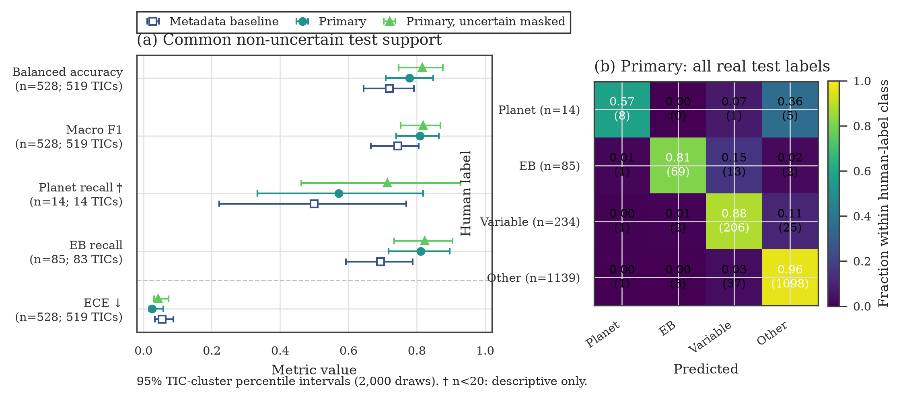

# Teacher v3: fixed-test performance and project verdict

## Abstract

Teacher v3 completed its checksum-bound S56--S62 training and single fixed-test
evaluation on ORCD. The primary shape/periodogram/BLS model improves over the
metadata-only control on a common set of `528` real, non-uncertain observations
from `519` TICs. Balanced accuracy rises from `0.720` to `0.779`, macro F1 from
`0.744` to `0.809`, and expected calibration error falls from `0.054` to
`0.025`. The independently retrained uncertain-masked control is at least as
strong on this common support, despite retaining only `3,333/8,163` active
rows. This identifies label policy and negative-set quality, rather than model
architecture, as the most actionable near-term limitation. Planet-like
performance remains descriptive because the real fixed-test support is only
`14` observations.

Teacher v3 is therefore suitable for enrichment and prioritized human review,
but not for automatic candidate acceptance, student pseudo-labeling, or a
science-ready survey release.

## Data and methods

The frozen release contains `8,181` observation rows (`7,724` real and `457`
injected), of which `8,163` are active. Whole TICs are assigned once to five
development folds or a fixed `20%` test population, yielding `6,534`
development rows and `1,629` fixed-test rows with no TIC leakage. The
observation-keyed native registry contains `7,705` real observations from
`7,571` unique TICs; `134` TICs occur in more than one sector.

Three predeclared models were evaluated:

1. a sealed metadata-only control;
2. the primary shape plus periodogram/BLS model under the accepted
   uncertain-as-other policy; and
3. a separate five-fold retraining after masking uncertain rows.

The primary and uncertain-masked models used ten GPU-trained folds in total on
one H200. Temperatures were fitted from pooled out-of-fold development logits.
All checkpoints and calibration files were frozen before the fixed test was
opened, and their hashes were identical before and after evaluation. Reported
intervals are `95%` percentile intervals from `2,000` complete-TIC bootstrap
draws with seed `560063`.

S62 required a bounded compatibility correction to inherited orbit identifiers:
`65,478` target-cadence rows (`0.606%`) were remapped from orbit 132 to the
authoritative orbit 131 assignment. Times, fluxes, uncertainties, quality
values, labels, and frozen splits were unchanged. This is adequate for the
Teacher v3 compatibility release, but it does not replace an upstream S62
rebuild before science-product promotion.

## Results

The primary comparison uses the same real, non-uncertain fixed-test rows for
all three models.

| Model | Balanced accuracy | Macro F1 | Planet recall | EB recall | ECE |
|---|---:|---:|---:|---:|---:|
| Metadata only | 0.720 [0.645, 0.792] | 0.744 [0.665, 0.805] | 0.500 [0.222, 0.769] | 0.694 [0.593, 0.788] | 0.054 [0.033, 0.088] |
| Primary | 0.779 [0.709, 0.848] | 0.809 [0.740, 0.865] | 0.571 [0.333, 0.818] | 0.812 [0.718, 0.896] | 0.025 [0.017, 0.058] |
| Primary, uncertain masked | 0.817 [0.746, 0.877] | 0.818 [0.753, 0.869] | 0.714 [0.462, 0.929] | 0.824 [0.733, 0.905] | 0.043 [0.031, 0.073] |

Planet recall has only `14` real observations and is descriptive. The
intervals also overlap, so these results do not establish a statistically
decisive advantage between the two shape-model label policies.

Under the accepted uncertain-as-other policy, the primary model classifies
`1,472` real fixed-test observations with accuracy `0.938`, balanced accuracy
`0.807`, and macro F1 `0.829`. Real-class performance is:

| Class | Support | Precision | Recall | F1 |
|---|---:|---:|---:|---:|
| Planet-like | 14 | 0.727 | 0.571 | 0.640 |
| Eclipse/contact | 85 | 0.932 | 0.812 | 0.868 |
| Smooth variable | 234 | 0.802 | 0.880 | 0.839 |
| Other | 1,139 | 0.972 | 0.964 | 0.968 |

The preserve/reject head, evaluated on all `1,629` active fixed-test rows,
reaches balanced accuracy `0.927` and macro F1 `0.925`. These numbers support
use as a review triage tool; they do not validate individual astrophysical
classifications.

**Figure 1.** Left: common-support model comparison with TIC-clustered
intervals. Right: the primary model confusion matrix on all active real
fixed-test labels under uncertain-as-other. The dagger marks the small
Planet-like support.

## Interpretation and next steps

The training infrastructure is now substantially stronger than the earlier
teacher releases: observation identity, split isolation, native inputs,
checkpoint selection, calibration, label-policy sensitivity, and the one-time
fixed-test opening are all explicit and checksum bound. Replacing the network
is not the highest-value next change.

The recommended sequence is:

1. freeze Teacher v3 as an enrichment-only model and publish the reviewed
   S56--S62 candidate table plus TIC roll-up;
2. score S63 with the frozen model, thresholds, and cohort definition, then
   perform one blind prospective review with Planet-like first, EB second, a
   predeclared random/control slice, and repeated hosts reported separately;
3. audit a small targeted set of uncertain examples selected by model
   disagreement, high confidence, and decision-boundary proximity instead of
   relabeling the full corpus; and
4. keep student pseudo-labeling disabled until the prospective result and rare
   Planet-like support justify it.

The dip branch, multi-sector merging, and branch-aware false-alarm calibration
remain necessary for a science-ready search, but they need not delay this
enrichment and prospective-validation sequence.

## Reproducibility

- ORCD training job: `18918808`, one H200, completed `0:0` in `02:17:59`.
- ORCD plotting job: `18918849`, CPU only, completed `0:0` in `00:12:07`.
- Training summary SHA-256:
  `0bdcb064a7e67f2304ba58b1e79c462daa7cc8aad5ad64d2f57a86c4dae46e99`.
- Pretest freeze SHA-256:
  `140ad51dcbbad66cc8fbb10a9fd138f383fdeb0698be47cc1f083a3e48ed2eb3`.
- Primary checkpoint-manifest SHA-256:
  `94ba7eb41e5f03657d279291127d2d06c59fe965b89f5708a1098c9ed7da9148`.
- Uncertain-masked checkpoint-manifest SHA-256:
  `cb006b75a262dd7016861b0d578cc254631819a5d6379cff7e3a6da374685027`.
- Automatic production promotion is `false`; student training remains blocked.

The accompanying [PDF](teacher_v3_performance.pdf), [metric table](teacher_v3_performance_metrics.csv),
[source-separated metrics](teacher_v3_source_metrics.csv), [confusion matrix](teacher_v3_primary_confusion_matrix.csv),
[reliability table](teacher_v3_performance_reliability.csv), and
[provenance record](teacher_v3_performance.provenance.json) are the exact
hash-verified ORCD plotting outputs.
