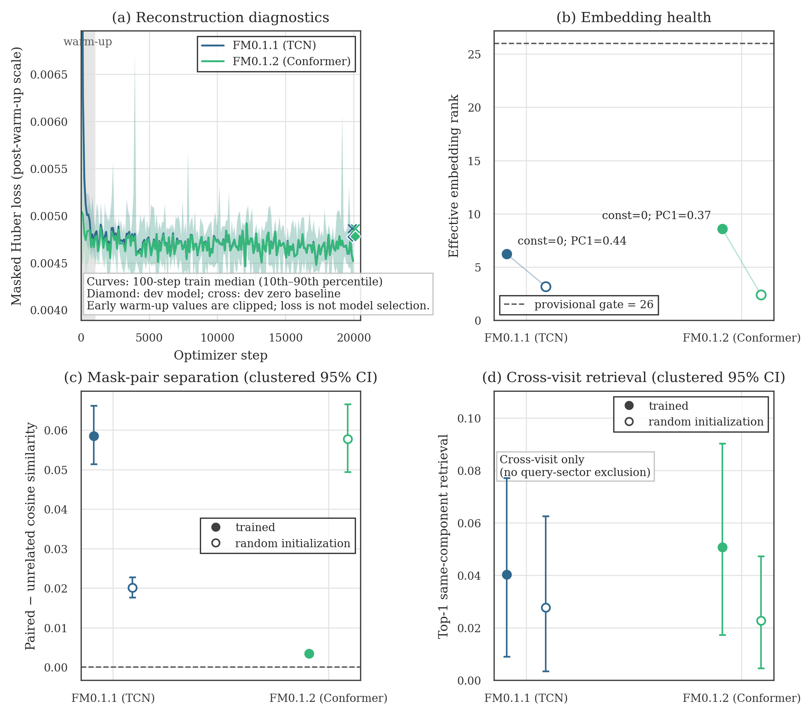

# TWIRL-FM0.1.1 versus FM0.1.2 development comparison

**Decision:** FM0.1 does not identify an architecture winner. Both the TCN and
Conformer completed valid one-H200 training runs, but both fail the provisional
effective-rank screen on the matched development population. Do not advance to
FM0.1.3, open the sealed test, or make a foundation-model claim from these
checkpoints.

## Controlled comparison

The two models consumed the same immutable BLS-free S56--S64 release, the same
`poc_train`/`poc_development` Gaia-component split, seed `560067`, 20,000
optimizer steps, BF16 arithmetic, effective batch of 64 windows, synchronized
masked reconstruction objective, and ADP `1x1 + 3x3` views. Both strict
post-validation receipts passed.

The matched evaluator used 256 held-out leakage components and 383 visits. The
component hash is `50e0b59e...f5c72f`, and the observation-key hash is
`9ffdc49e...20546a` for both models. It used no labels, BLS/search fields,
candidate information, injection truth, model-visible identity, or sealed-test
row. The evaluator revision is `9cb8c960...d67bee`; the immutable training
revision is `ece8619f...880cb`.

| Quantity | FM0.1.1 TCN | FM0.1.2 Conformer |
| --- | ---: | ---: |
| Parameters | 8,825,602 | 9,345,282 |
| Training time | 20.11 H200 h | 19.72 H200 h |
| Effective windows per second | 17.68 | 18.03 |
| Final logged training Huber | 0.0046390 | 0.0046437 |
| Median Huber over final 1,000 steps | 0.0046637 | 0.0046636 |
| Matched-development Huber | 0.0047750 | 0.0047800 |
| Improvement over zero prediction | 1.84% | 1.74% |
| Effective rank of 256-D embedding | **6.20 (fail)** | **8.58 (fail)** |
| Leading-PC variance share | 0.443 | 0.374 |
| Paired-minus-unrelated cosine, clustered 95% interval | 0.0585 [0.0514, 0.0662] | 0.00347 [0.00297, 0.00401] |
| Cross-visit top-1 retrieval, clustered 95% interval | 0.0403 [0.0090, 0.0771] | 0.0507 [0.0174, 0.0903] |

The Conformer has 5.89% more parameters than the TCN and is 1.96% faster in
the training invocation, so the parameter and compute matching worked. The
final-1,000-step losses differ by only 0.0025%, which is an optimization tie.
The single lowest observed training loss is not a selection metric; both
minima happened on the same step (`17,450`), consistent with a shared difficult
or easy batch rather than an architecture decision.

## Interpretation

1. **The reconstruction task is numerically learnable but weak.** Both models
   beat a zero-prediction development baseline by less than 2%. For
   median-centered, mostly quiet light curves, zero is already a strong answer.
2. **The pooled window representations are strongly concentrated.** The frozen
   provisional screen is effective rank >= 26, zero constant dimensions, and a
   positive lower confidence bound for paired-mask separation. Both models
   pass the latter two checks but reach only 24% and 33% of the rank threshold.
3. **The architecture signals disagree.** The TCN has much stronger
   paired-mask separation and improves over its random control. The Conformer
   has somewhat higher rank and repeated-visit retrieval, but its separation is
   much weaker than its architecture-matched random control. Retrieval
   intervals are broad and overlap; neither model establishes a robust win.
4. **This points to the objective/representation path before the backbone.** A
   plausible mechanism is that cadence-level reconstruction can improve while
   the mean-pooled `z_window` remains low-rank. Rare morphology contributes
   little to an average flux loss, and FM0.1.1/0.1.2 place no explicit
   variance/covariance pressure on the pooled embedding. This is an inference
   from the diagnostics, not yet a proven causal decomposition.

The JSON field `passed: true` means that an evaluator completed and its
provenance checks passed. It does not mean that a checkpoint passed the
scientific representation thresholds.

## Recommendation

Treat FM0.1 as a successful proof-of-concept **failure-finding run** and stop
the frozen ladder here. FM0.1.3 assumes a development architecture winner, and
none exists. Adding ADP015 or raw-relative views now would confound a view test
with an unresolved collapsed-representation problem.

The next named design should be FM0.2, keeping the same immutable release,
source split, ADP `1x1 + 3x3` inputs, masks, and compute accounting while
changing only the representation objective. The proposed sequence is:

1. Add CPU diagnostics for pre-projection pooled states versus `z_window`, a
   source-paired TCN-minus-Conformer bootstrap, a query-sector-excluded
   repeated-host retrieval test, and transparent simple/PCA baselines.
2. Freeze a small FM0.2 canary in which same-window VICReg (or another explicit
   non-collapse term) acts on `z_window` from the start. Run short checkpoints
   first and evaluate rank during training; do not spend another pair of full
   20-hour runs merely to reproduce a large gate failure.
3. Predeclare the reconstruction-baseline and event-retention requirements
   before looking at the canary. Continue only if rank >= 26, constant
   dimensions remain zero, paired separation stays positive, and a development
   event/injection canary is retained.
4. Once that objective passes, compare the two architectures with both frozen
   seeds. If the Conformer does not beat the TCN outside source-clustered
   uncertainty, retain the simpler TCN.
5. Resume the one-change-at-a-time data ladder only afterward: add ADP015 for
   both apertures, then raw-relative for both apertures. Keep the sealed test
   closed until one complete finalist is frozen.

The unrun seed `560068`, linear morphology probe, development injection
retention, sector/camera/CCD/magnitude/missingness shortcut probes, and true
cross-sector retrieval remain missing evidence. They are not silently inferred
from the present plot.

## Artifacts

- [PNG figure](fm0_1_1_vs_fm0_1_2_development.png) and
  [PDF figure](fm0_1_1_vs_fm0_1_2_development.pdf)
- [Comparison metrics](comparison_metrics.csv)
- [Binned optimization traces](training_curve_bins.csv)
- [Machine-readable provenance](comparison.provenance.json)
- [Attempt and error ledger](error_ledger.csv)
- [`receipts/`](receipts/) contains compact logs, run contracts, summaries,
  strict post-validation receipts, and matched development-evaluation receipts.

This report is development-only representation evidence. It is not a
classification result, transit-recovery result, survey result, discovery
claim, production promotion, or foundation-model claim.
