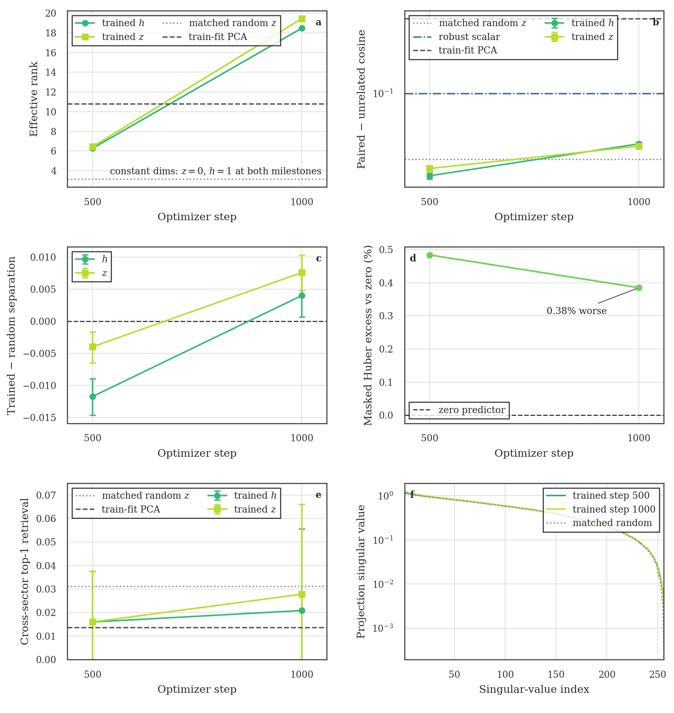
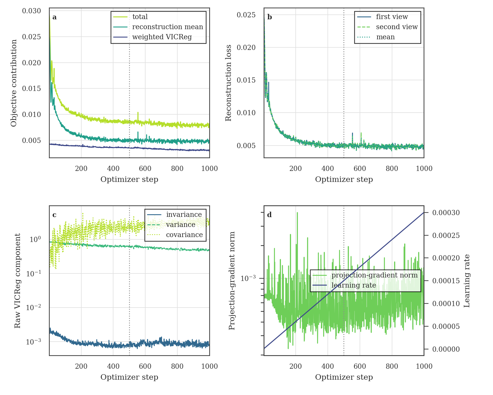

# TWIRL-FM0.2.1 step-1000 development trajectory

**Status:** the immutable step-1000 continuation, strict CPU post-validation,
and frozen development-only representation evaluation all completed
successfully. The result is encouraging trajectory evidence, not a formal
scientific gate, production authorization, or foundation-model claim.

## Representation trajectory

From step 500 to step 1000, effective rank rises from 6.28 to 18.46 for
`h_window` and from 6.45 to 19.43 for `z_window`. Both source-paired
trained-minus-random intervals cross from negative to positive:

| Quantity | Step 500 | Step 1000 |
| --- | ---: | ---: |
| `h_window` trained-minus-random | -0.01173 [-0.01466, -0.00895] | 0.00401 [0.00067, 0.00722] |
| `z_window` trained-minus-random | -0.00397 [-0.00645, -0.00163] | 0.00759 [0.00485, 0.01035] |
| `h_window` paired-minus-unrelated | 0.01357 [0.01256, 0.01450] | 0.02931 [0.02803, 0.03057] |
| `z_window` paired-minus-unrelated | 0.01618 [0.01504, 0.01725] | 0.02774 [0.02654, 0.02899] |

The learned representations therefore gain measurable paired-view structure
beyond the matched random encoder. They still do not establish task-level
utility: cross-sector retrieval remains weak, and the train-fit PCA and robust
scalar baselines retain much stronger paired-minus-unrelated separation.

Development masked Huber improves from 0.48% to 0.38% above the zero
predictor, but it still does not beat that trivial baseline. The projection
matrix remains full numerical rank; its effective rank changes from 154.45 to
152.24 while its condition number increases from 244 to 415. This is not
weight-matrix collapse, but it is mild conditioning deterioration.

## Immutable training-component history

The component figure plots every stored optimizer step without smoothing.
Total objective falls from 0.02922 at step 1 to 0.008604 at step 500 and
0.007837 at step 1000. The step-1000 reconstruction first/second/mean terms
are 0.004762, 0.004731, and 0.004747. VICReg invariance, variance, covariance,
and the weighted VICReg contribution are shown separately, along with the
projection-gradient norm and linear warmup to the 0.0003 learning rate.

## Evidence boundary

The frozen configuration requires representation evaluation of the exact
same-seed `checkpoint_step_00000000.pt` initialization. The currently reviewed
CPU wrapper authorizes only steps 500, 1000, and 2000, so the checksum-bound
step-0 path remains an evidence-completeness item. The matched random encoder
is not a substitute for that exact initialization. The 0-to-500-to-1000
trajectory bundle must not be called complete until the step-0 path is
reviewed and executed or the evidence requirement is explicitly changed.

No formal step-2000 gate was applied, development event retention was not run,
and the sealed test was not opened.

## Provenance and files

- Training revision: `ddf442aafb8f62966e549e2287abad3474dd556a`
- Evaluator revision: `83816d07975eebe3825d76dfe7096d22b70376f5`
- Step-1000 checkpoint SHA-256:
  `a8467728383ee80e65bae2cef6ce9036b8cc4a58aa2cc48b49ad5d4e064071b9`
- Step-1000 evaluation SHA-256:
  `5d7232bdf8cd5e631cf62cdef940db10692f1043fefd9463f89d0a6b07f6ff46`
- Step-1000 representation receipt SHA-256:
  `8cb772314b52689fa1b47e585013dc34fa8dd8e31a8a104411b7fa60da3187fa`
- Post-validation receipt SHA-256:
  `93119227f7f84bac0aec522505de31a51bc2424c73f8b1d78f19e2ebc5410eae`
- ORCD evaluation job `21199873`: completed `0:0` in 5m11s with four CPUs,
  16 GiB requested, no GPU, and zero sealed-test access.
- [Representation PNG](fm0_2_step1000_representation_trajectory.png),
  [representation PDF](fm0_2_step1000_representation_trajectory.pdf),
  [training-components PNG](fm0_2_step1000_training_components.png), and
  [training-components PDF](fm0_2_step1000_training_components.pdf).
- [Metric table](step500_step1000_metrics.csv) and
  [complete training trace](training_trace.csv).
- [`receipts/`](receipts/) contains the checksum-bound evaluator output,
  evaluator receipt, post-validation receipt, compact training summary,
  source log, and exact checkpoint-history extract used by the figures.

This report is development-only trajectory evidence. It is not a
classification result, event-retention result, sealed-test result, production
promotion, survey result, or foundation-model claim.
