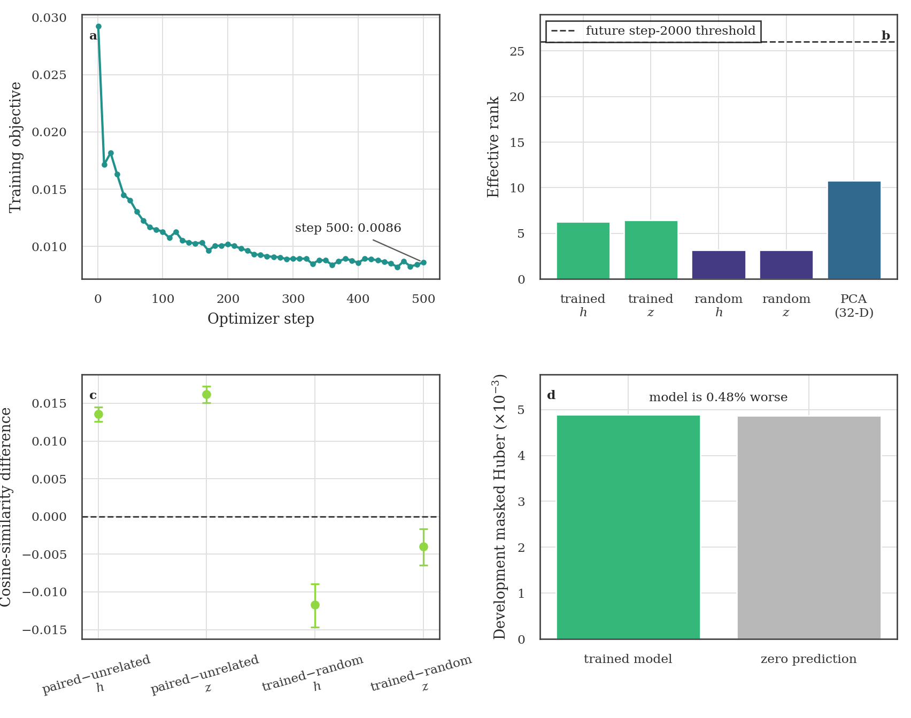

# TWIRL-FM0.2.1 step-500 development evaluation

**Decision:** step 500 passes its mechanical and provenance checks but does not
yet show a useful learned foundation representation. Continue only to the
already frozen step-1000 milestone, then repeat this exact evaluation. Do not
apply the formal go/no-go decision, run event retention, open the sealed test,
or make a foundation-model claim before step 2000.



## What was evaluated

The immutable `TWIRL-FM0.2.1` TCN checkpoint at optimizer step 500 was first
strict-loaded by an independent CPU post-validator. A second CPU-only job then
ran the frozen evaluator-v2 contract on the same 256 development leakage
components and 383 visits used by the FM0.1 comparison. Its deterministic Gaia
observation-to-sector authority covers all nine S56--S64 train/development
manifests exactly. Sector is used only to exclude same-sector visits from the
retrieval gallery; it is not model-visible.

```text
step 0          step 500          step 1000          step 2000
random  ────────●──────────────────○──────────────────◎
                current evidence   next milestone     formal go/no-go
                no verdict                             + event retention
```

The evaluator read 512 training windows only to fit transparent PCA and robust
scalar baselines, plus 895 development windows for model metrics. It read zero
sealed-test windows and used no labels, BLS/search fields, candidate data,
injection truth, sector identifiers, or model-visible source identity.

## Step-500 findings

The frozen scientific thresholds are formally applied only at step 2000. The
last column below asks only whether the step-500 value would meet each future
threshold now.

| Future step-2000 quantity | Step 500 | Future rule | Meets now? |
| --- | ---: | ---: | :---: |
| `z_window` effective rank | 6.447 | >= 26 | no |
| `z_window` constant dimensions | 0 | <= 0 | yes |
| paired-minus-unrelated clustered 95% lower bound | 0.01504 | > 0 | yes |
| trained-minus-random clustered 95% lower bound | -0.00645 | > 0 | no |
| development masked Huber | 0.0048881 | <= 0.0048646 | no |
| sealed-test access count | 0 | = 0 | yes |

Three results matter most.

1. **The representation remains low-rank.** `z_window` reaches effective rank
   6.45 of 256, only 24.8% of the future minimum. Pre-projection `h_window` is
   similarly low at 6.28 and even has one constant dimension. The learned
   projection matrix itself is full numerical rank (256; effective rank
   154.45), so the bottleneck is the distribution of encoded windows rather
   than a singular projection weight matrix.
2. **Mask agreement is not yet evidence of useful learning.** The trained
   `z_window` paired-minus-unrelated cosine difference is positive, 0.01618
   [0.01504, 0.01725], but its matched random encoder reaches 0.02015. The
   trained-minus-random result is therefore negative, -0.00397
   [-0.00645, -0.00163]. Training has made the two masks agree, but at step 500
   it has also made unrelated stars too similar.
3. **Reconstruction has not beaten the trivial answer.** Development masked
   Huber is 0.0048881 versus 0.0048646 for predicting zero fractional flux,
   so the trained model is 0.48% worse. Training objective fell from 0.02922 at
   step 1 to 0.008604 at step 500, but that composite loss decrease does not
   by itself establish a better representation or reconstruction.

## Transparent baselines and repeated-star test

| Representation | Effective rank | Paired-minus-unrelated (95% interval) | Cross-sector top-1 retrieval (95% interval) |
| --- | ---: | ---: | ---: |
| trained `h_window` | 6.282 | 0.01357 [0.01256, 0.01450] | 0.0201 [0.0000, 0.0375] |
| trained `z_window` | 6.447 | 0.01618 [0.01504, 0.01725] | 0.0201 [0.0000, 0.0375] |
| matched random `z_window` | 3.171 | 0.02015 [0.01763, 0.02278] | 0.0302 [0.0069, 0.0661] |
| train-fit 32-D PCA | 10.813 | 0.60007 [0.56395, 0.63680] | 0.0201 [0.0000, 0.0329] |
| robust scalar baseline | 1.934 | 0.09863 [0.08544, 0.11323] | 0.0302 [0.0069, 0.0903] |

The PCA and scalar comparisons show that mask-stable structure is readily
available in the light curves, but the present encoder has not organized it
well. None of the representations establishes strong cross-sector source
retrieval: the trained interval includes zero and does not improve on the
transparent baselines. Retrieval is based on 199 eligible queries from 72
repeated components and excludes every gallery visit from the query sector.

## Recommendation

Continue to step 1000 because step 500 is only halfway through the 1000-step
linear warmup: the learning rate is 0.0001503 versus its 0.0003 target, the
projection gradient is finite and nonzero, the composite objective is still
falling, and the frozen contract intentionally placed the formal decision at
step 2000. This is enough evidence that continuing one more bounded milestone
is informative; it is not evidence that the model is good.

At step 1000, repeat this exact development panel and look for a trajectory,
not merely a lower training loss:

- `z_window` rank should move materially upward from 6.45;
- trained-minus-random separation should move toward or above zero;
- development Huber should beat the zero predictor;
- cross-sector retrieval should not deteriorate;
- constant dimensions and sealed-test access must remain zero.

If those directions remain flat or worsen at step 1000, step 2000 is still the
predeclared formal decision point, but the likely FM0.3 lesson will be that the
current scale-matched VICReg pressure is too weak or acts too late to overcome
the low-rank upstream encoder state. Do not change the objective during the
frozen FM0.2.1 canary.

## Provenance and artifacts

- Training revision: `ddf442aafb8f62966e549e2287abad3474dd556a`
- Evaluator revision: `83816d07975eebe3825d76dfe7096d22b70376f5`
- Step-500 checkpoint SHA-256:
  `529a17772e0734c44ec6e50c7e4ec5ca338170c1878326afc054dc0f92fb18dd`
- CPU post-validation receipt SHA-256:
  `f90a2cb96433eb0885d75fc303536d97d690f1e0f721fe0eb674add3ce736e43`
- ORCD evaluation job: `21139847`, completed `0:0` in 5m15s with four CPUs,
  16 GiB requested, 3.24 GiB peak RSS, and no GPU.
- [PNG](fm0_2_step500_diagnostics.png),
  [PDF](fm0_2_step500_diagnostics.pdf),
  [threshold diagnostics](step500_threshold_diagnostics.csv), and
  [training trace](training_trace.csv).
- [`receipts/`](receipts/) contains the checksum-bound evaluator output,
  receipt, compact training summary, and source logs.

This report is development-only trajectory evidence. It is not a
classification result, event-retention result, sealed-test result, production
promotion, survey result, or foundation-model claim.
